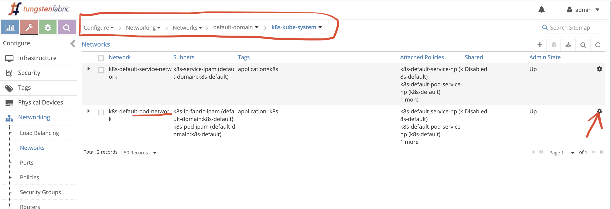

### Steps given by Andrey

* In order to support Keystone AAA in Kubernetes the client-keystone-auth client is used to generate the required environmental variables to authenticate kubectl commands against a keystone server. Once the token is generated the kubectl command the kubernetes cluster can be used without modification. 

Steps:

1. disable IP Fabric Forwarding for pod network in default/kube-system project and enable snat (it’s required to reach keystone service from keystone-auth POD. It’s possible to do via ‘kubectl edit ns default’ and add annotation:


```sh
metadata:
  annotations:
    opencontrail.org/ip_fabric_snat: "true"
```

2. apply policy.json from below comment with juju config kubernetes-master keystone-policy="$(cat policy.json)"

3. install client tools on jumphost or any other node outside of cluster

sudo snap install kubectl --classic
sudo snap install client-keystone-auth --edge

4. configure context

kubectl config set-context keystone --user=keystone-user
kubectl config use-context keystone
kubectl config set-credentials keystone-user --exec-command=/snap/bin/client-keystone-auth
kubectl config set-credentials keystone-user --exec-api-version=client.authentication.k8s.io/v1beta1

5. either export required settings or prepare stackrc and source it

export OS_IDENTITY_API_VERSION=3
export OS_USER_DOMAIN_NAME=admin_domain
export OS_USERNAME=admin
export OS_PROJECT_DOMAIN_NAME=admin_domain
export OS_PROJECT_NAME=admin
export OS_DOMAIN_NAME=admin_domain
export OS_PASSWORD=password
export OS_AUTH_URL=http://192.168.30.78:5000/v3

6. use it

root@noden18:[~]$ kubectl -v=5 --insecure-skip-tls-verify=true -s https://192.168.30.29:6443 get pods --all-namespaces
NAMESPACE     NAME                                READY   STATUS    RESTARTS   AGE
default       cirros                              1/1     Running   0          30h
kube-system   coredns-6b59b8bd9f-2nb4x            1/1     Running   57         33h
kube-system   k8s-keystone-auth-db47ff559-sh59p   1/1     Running   0          33h
kube-system   k8s-keystone-auth-db47ff559-vrfwd   1/1     Running   0          33h

To use with different user/project please create them, source creds and use.

Used doc: Keystone Auth for Charmed Kubernetes with Canonical is documented here… https://ubuntu.com/kubernetes/docs/ldap